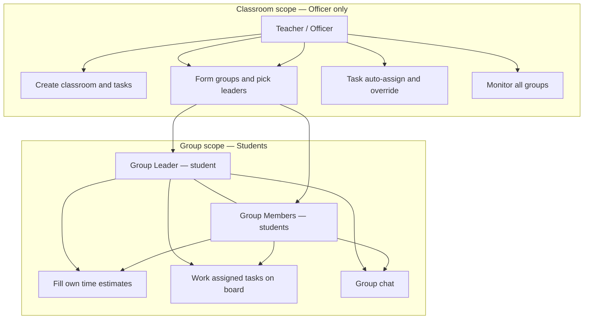
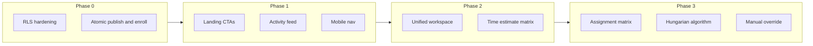

# Trippy-Tropa — Product Requirements Document

**Product:** Trippy-Tropa (Smart Collaborative Group Management System)  
**Version:** 1.0  
**Last updated:** 2026-05-23  
**Status:** Living document — gaps first, then phased delivery

---

## 1. Executive summary

Trippy-Tropa is a mobile-first, responsive web application for academic group work. A **classroom Officer (teacher)** runs the class: creates the classroom, forms groups, defines project tasks, and runs classroom-wide assignment. **Group Leaders** and **Group Members** are both **students** in the app (`profiles.role = student`); leaders are designated per group and coordinate that group’s work. Students join via invite links, complete skill assessments, fill time-estimate matrices, collaborate in group workspaces, and execute tasks on Kanban boards.

The codebase today delivers a **strong officer backend** (classrooms, groups, tasks, auto-assign) and **core student flows** (auth, onboarding, join, Kanban, group chat, notifications). Remaining gaps include **leader override UX polish**, **customizable onboarding**, **Hungarian assignment**, and **production security hardening**.

> **Authority model (read first):** See [§2.5 Role hierarchy](#25-role-hierarchy-and-authority-model). Do not conflate **classroom Officer** powers with **group Leader** (student) responsibilities.

This PRD leads with **missing and partial functionality**, maps them to the original nine-screen spec, and defines a **six-phase roadmap** (Phase 0–5) to close gaps.

---

## 2. Context

### 2.1 Stack and references

| Layer | Technology |
|-------|------------|
| Frontend | Next.js 16 (App Router), React 19, TypeScript |
| Styling | Tailwind CSS v4, shadcn/ui, Stitch design tokens |
| Backend | Supabase (Auth, Postgres, Realtime, Storage planned) |
| Design system | [`.interface-design/system.md`](../../.interface-design/system.md) |

### 2.2 Personas (summary)

| Persona | App role | Scope | Primary goals |
|---------|----------|-------|----------------|
| **Teacher / Officer** | `profiles.role = officer` | Whole **classroom** | Create class, invite students, publish groups, set **group leaders**, create tasks, run **task** auto-assign / override, monitor all groups |
| **Group Leader** | `student` + `groups.leader_id` | One **group** | Same as member, plus visible leader status; coordinates group (future: leader-only actions TBD) |
| **Group Member** | `student` in `group_members` | One **group** | Self-assess skills, join workspace, fill **time estimate** matrix row, execute assigned Kanban tasks |

Officers use `/officer/*` routes. Leaders and members share `/student/*` routes; leader is a **group attribute**, not a separate login role.

### 2.5 Role hierarchy and authority model

This is the canonical permission model for product and engineering decisions.



| Level | Who | How identified | What they control today |
|-------|-----|----------------|-------------------------|
| **1 — Classroom Officer** | Teacher (or designated instructor) | `profiles.role = officer`, `classrooms.created_by` | Class roster, invite, **group generation & publish**, **group leader** selection (auto or manual), **task CRUD**, **task assignment** (auto-assign, reassign all, manual override), analytics, activity feed |
| **2 — Group Leader** | Student | `groups.leader_id` + `group_members` | Same as member in workspace; UI highlights leader; **does not** create classroom tasks or run classroom auto-assign (unless future leader permissions are added) |
| **3 — Group Member** | Student | `group_members` only | Onboarding skills, workspace (board, chat, estimates), Kanban for **tasks assigned to them** |

**Two different “assignment” flows (do not merge):**

| Flow | Actor | Input | Output |
|------|--------|-------|--------|
| **A — Group formation** | Officer | Enrolled students + skill ratings | Students placed in groups; **one leader per group** via skill balancer (default: highest leadership in group) or **officer manual override** (DnD / group management before publish) |
| **B — Task assignment** | Officer | Group **tasks** (coding, slides, docs, …) + **member×task time estimate matrix** (every student, including leaders, submits their own hours) | Greedy/Hungarian assigns each **task** to one **member**; officer may **override** assignee; idempotent re-run leaves existing assignees unless “reassign all” |

**Product implications (correcting earlier ambiguity):**

- **Time estimates (GAP-F-014):** Filled by **all group members and leaders** (each person’s own row). Officers do **not** set per-task hour budgets.
- **Task override (GAP-F-016):** **Officer-only** at classroom task level. Leaders do not reassign tasks in the current scope.
- **Group leader override:** Part of **group formation (Flow A)**, not task assignment. Implemented via [`group-generation-view.tsx`](../../src/components/officer/group-generation-view.tsx) (auto leader + DnD). Document/enhance under GAP-A-004 / group management, not under task matrix features.

**Future (out of current scope unless prioritized):**

- Leader-scoped permissions (e.g. nudge estimates, propose task splits) — requires new gaps and RLS.
- Student-as-officer in another classroom (same account, different `role` per product rules) — today one `role` per profile.

### 2.3 Route map

Defined in [`src/lib/constants/routes.ts`](../../src/lib/constants/routes.ts):

| Area | Routes |
|------|--------|
| Public | `/`, `/login`, `/register`, `/join`, `/join/c/[code]` |
| Onboarding | `/onboarding/skills` |
| Officer | `/officer/dashboard`, `/officer/classrooms/new`, `/officer/classrooms/[id]`, groups, tasks |
| Student | `/student/dashboard`, `/student/classrooms/[id]/group`, `tasks`, `assignments` |

### 2.4 Design direction

- **Feel:** Clean modern SaaS — Notion × ClickUp × Discord (structure + collaboration)
- **Palette:** Blue (`#004ac6`), white, subtle gray (`#faf8ff` canvas, `#c3c6d7` borders)
- **Typography:** Plus Jakarta Sans (`font-heading` for titles)
- **Layout:** Dashboard cards, Kanban columns, soft rounded corners, subtle shadows
- **Responsive:** Mobile bottom tabs (student/officer shells), desktop sidebars

---

## 3. Missing and partial functionality (priority inventory)

Gaps are ordered **P0** (production / integrity) → **P1** (core PRD screens) → **P2** (differentiation) → **P3** (polish).

Legend: **Status** = `missing` | `partial` | `stub`

---

### 3.1 P0 — Production safety and data integrity

| ID | Area | Status | Evidence | Required behavior | Acceptance criteria |
|----|------|--------|----------|-------------------|---------------------|
| GAP-S-001 | Profile privilege escalation | partial | [`supabase/migrations/003_rbac_auth.sql`](../../supabase/migrations/003_rbac_auth.sql) — `profiles_update_own` | Students cannot set `role = officer` or `skills_completed = true` via client | Manual test: `UPDATE profiles SET role = 'officer'` fails for authenticated student |
| GAP-S-002 | Classroom invite enumeration | partial | `classrooms_select` policy `using (true)` | Invite lookup scoped; no bulk read of all `invite_code` | Anon/authenticated client cannot list all classrooms |
| GAP-S-003 | Dev-only admin signup | partial | [`src/app/actions/auth.ts`](../../src/app/actions/auth.ts), [`src/lib/supabase/admin.ts`](../../src/lib/supabase/admin.ts) | `SUPABASE_SERVICE_ROLE_KEY` signup only when `NODE_ENV=development` or explicit flag | Production deploy without service role still registers via standard Auth |
| GAP-S-004 | Non-atomic group publish | partial | [`src/app/actions/groups.ts`](../../src/app/actions/groups.ts) `publishGroups` | Delete + insert in transaction or safe swap | Mid-failure leaves prior groups or clear rollback |
| GAP-S-005 | Enroll after skills race | partial | [`src/app/actions/join-classroom.ts`](../../src/app/actions/join-classroom.ts) `completeSkillAssessment` | Set `skills_completed` only after successful enroll when invite present | Failed enroll does not block re-onboarding |
| GAP-S-006 | Weak task delete authorization | partial | [`src/app/actions/tasks.ts`](../../src/app/actions/tasks.ts) `deleteTask` | Verify task belongs to `classroomId` before delete | Wrong ID returns error, zero rows deleted |
| GAP-S-007 | Predictable invite codes | partial | [`src/lib/invite.ts`](../../src/lib/invite.ts) | CSPRNG + longer codes | Codes not guessable via `Math.random` |
| GAP-S-008 | Performance: auto-assign N+1 | partial | [`src/app/actions/tasks.ts`](../../src/app/actions/tasks.ts) | Batch queries + bulk updates | Single classroom assign &lt; 2s for 50 tasks / 30 students |
| GAP-S-009 | Performance: DB indexes | missing | Migrations 001–009 | Indexes on `tasks(group_id)`, `group_members(user_id)`, `classroom_members`, etc. | Migration `010_indexes.sql` applied |

**Dependencies:** Phase 0 blocks production launch.

---

### 3.2 P1 — Core user journeys and PRD screens

| ID | PRD screen | Feature | Status | Evidence | Required behavior | Acceptance criteria |
|----|------------|---------|--------|----------|-------------------|---------------------|
| GAP-F-001 | 1 Landing | Hero + dual CTA above fold | full | [`src/app/page.tsx`](../../src/app/page.tsx) | Primary: **Join classroom** → `/join`; Secondary: **Create classroom** → `/officer/classrooms/new` | Both CTAs visible without scrolling on mobile |
| GAP-F-002 | 1 Landing | Features section (3–4 pillars) | full | [`src/app/page.tsx`](../../src/app/page.tsx) | Dedicated features grid: group formation, task assignment, collaboration, progress | Icons + copy match PRD positioning |
| GAP-F-003 | 2 Auth | Password reset | full | [`forgot-password-card.tsx`](../../src/components/auth/forgot-password-card.tsx), [`reset-password-card.tsx`](../../src/components/auth/reset-password-card.tsx), [`auth/callback/route.ts`](../../src/app/auth/callback/route.ts) | Supabase reset email flow | User receives reset link and can set new password |
| GAP-F-005 | 2 Auth | Preserve invite `code` in middleware | full | [`login-redirect.ts`](../../src/lib/auth/login-redirect.ts), [`middleware.ts`](../../src/lib/supabase/middleware.ts) | Redirects to login keep `?code=` and `redirect` | Register from invite resumes join after auth |
| GAP-F-006 | 4 Dashboard | Classroom activity feed | full | [`010_classroom_activity_events.sql`](../../supabase/migrations/010_classroom_activity_events.sql), [`activity.ts`](../../src/app/actions/activity.ts), [`classroom-activity-feed.tsx`](../../src/components/officer/classroom-activity-feed.tsx) | Chronological events: enroll, group publish, task changes, assign runs | Officer sees last 20 events per classroom or global |
| GAP-F-007 | 4 Dashboard | Create classroom modal | full | [`create-classroom-sheet.tsx`](../../src/components/classrooms/create-classroom-sheet.tsx), [`create-classroom-form.tsx`](../../src/components/classrooms/create-classroom-form.tsx) | Sheet on dashboard with same fields as create page | Create without leaving dashboard |
| GAP-F-008 | 4 Dashboard | Student join from dashboard | full | [`join-classroom-inline.tsx`](../../src/components/student/join-classroom-inline.tsx), [`student-dashboard-view.tsx`](../../src/components/student/student-dashboard-view.tsx) | Invite code field → enroll | Student joins new class from dashboard |
| GAP-F-010 | 4 Dashboard | Student search / schedule | full | [`student-dashboard-view.tsx`](../../src/components/student/student-dashboard-view.tsx) | Search/schedule stubs removed until implemented | No misleading enabled controls |
| GAP-F-011 | 5 Classroom detail | Interactive analytics charts | full | [`classroom-analytics-charts.tsx`](../../src/components/officer/classroom-analytics-charts.tsx), [`classroom-analytics.ts`](../../src/lib/officer/classroom-analytics.ts) | Recharts bar (skills) + line (enrollment trend) | At least 2 chart types on detail page |
| GAP-F-012 | 6 Workspace | Unified tabbed workspace | full | [`student-group-workspace-view.tsx`](../../src/components/student/student-group-workspace-view.tsx), [`group-workspace.ts`](../../src/lib/constants/group-workspace.ts) | Single route: **Board \| Members \| Chat \| Time estimates** | No extra navigation to reach Kanban |
| GAP-F-013 | 6 Workspace | File upload / shared files | **removed** | Out of scope — students use Google Drive / Docs externally | N/A | N/A |
| GAP-F-014 | 7 Assignment | Student time estimate matrix | full | [`011_task_time_estimates.sql`](../../supabase/migrations/011_task_time_estimates.sql), [`time-estimates.ts`](../../src/app/actions/time-estimates.ts), [`group-workspace-estimates-panel.tsx`](../../src/components/student/group-workspace-estimates-panel.tsx) | Rows = **leaders + members**; cols = group tasks; each student self-reports hours for themselves; officer does not set task time | All group members (incl. leaders) submit before officer auto-assign |
| GAP-F-015 | 7 Assignment | Matrix / heatmap visualization | full | [`assignment-matrix.tsx`](../../src/components/officer/assignment-matrix.tsx), [`assignment-matrix-data.ts`](../../src/lib/tasks/assignment-matrix-data.ts) | Grid colored by assignee + match score | Officer sees student × task grid after optimize |
| GAP-F-016 | 7 Assignment | Manual **task** assignment override | full | [`012_assignment_audit.sql`](../../supabase/migrations/012_assignment_audit.sql), [`task-assignment-override-dialog.tsx`](../../src/components/officer/task-assignment-override-dialog.tsx), `overrideTaskAssignment` in [`tasks.ts`](../../src/app/actions/tasks.ts) | **Officer** reassigns a **task** to another group member; optional reason; audit log | Override persists; student notification sent |
| GAP-F-017 | 7 Assignment | Idempotent auto-assign | full | [`autoAssignTasks`](../../src/app/actions/tasks.ts), [`officer-tasks-view.tsx`](../../src/components/officer/officer-tasks-view.tsx) | Default: only unassigned tasks; `forceReassign` for officer | Re-run does not reshuffle unless forced |
| GAP-F-018 | 8 Teacher | Participation metrics | full | [`participation.ts`](../../src/app/actions/participation.ts), [`participation-dashboard.tsx`](../../src/components/officer/participation-dashboard.tsx), [`013_tasks_updated_at.sql`](../../supabase/migrations/013_tasks_updated_at.sql) | Per-student: last active, tasks moved, messages sent, assessment status | Officer identifies at-risk students |
| GAP-F-019 | 8 Teacher | Cross-classroom student reassignment | **removed** | — | Officers **invite only**; no bulk reassign of students between classrooms | N/A |
| GAP-F-020 | 3 Onboarding | Officer-customizable skills + multipliers | full | [`014_classroom_skill_templates.sql`](../../supabase/migrations/014_classroom_skill_templates.sql), [`classroom-skills.ts`](../../src/app/actions/classroom-skills.ts), [`classroom-skill-templates-editor.tsx`](../../src/components/officer/classroom-skill-templates-editor.tsx), [`skill-assessment-view.tsx`](../../src/components/onboarding/skill-assessment-view.tsx) | Officer defines per-class metrics (label, description, 1–5, **multiplier**); students self-assess on join; weighted scores drive group balance | Dynamic onboarding per classroom; officer editor on classroom detail |
| GAP-F-021 | 9 Mobile | Tasks tab routing | full | [`student/tasks/page.tsx`](../../src/app/student/tasks/page.tsx), [`student-tasks-view.tsx`](../../src/components/student/student-tasks-view.tsx), [`tasks-nav.ts`](../../src/lib/student/tasks-nav.ts) | Tasks tab → `/student/tasks` aggregate list; single-class students redirect to group board; tab active on board routes | Tab highlights on tasks hub and group workspace |
| GAP-F-022 | 9 Mobile | Notifications tab routing | partial | Hash `#updates` on dashboard only | Dedicated `/student/notifications` or scroll to feed | Tab opens notification list |
| GAP-F-023 | 9 Mobile | Responsive Kanban | partial | [`kanban-board.tsx`](../../src/components/tasks/kanban-board.tsx) | Horizontal scroll columns on `sm`; touch DnD | Usable on 375px width |

**Dependencies:** P1 items depend on Phase 0 for RLS. In-app file upload (F-013) is out of scope.

---

### 3.3 P2 — Algorithms and documentation (from product notes)

| ID | Feature | Status | Evidence | Required behavior | Acceptance criteria |
|----|---------|--------|----------|-------------------|---------------------|
| GAP-A-001 | Greedy assignment documentation | full | [`docs/algorithms/greedy-assignment.md`](../../docs/algorithms/greedy-assignment.md), [`auto-assign-help-guide.tsx`](../../src/components/officer/auto-assign-help-guide.tsx), [`officer/docs/auto-assign`](../../src/app/officer/docs/auto-assign/page.tsx) | Plain-language guide: prerequisites, steps, skill fit, limitations, speed; linked from task management | Officers can read how auto-assign works before running it |
| GAP-A-002 | Hungarian algorithm implementation | full | [`hungarian.ts`](../../src/lib/algorithms/hungarian.ts), [`hungarian-assigner.ts`](../../src/lib/algorithms/hungarian-assigner.ts) | Repeated Hungarian rounds per group; cost from skill fit + hour budget | Auto-assign uses optimal bipartite matching per round |
| GAP-A-003 | Hungarian documentation | full | [`greedy-assignment.md`](../../docs/algorithms/greedy-assignment.md) (updated) | Plain-language guide for instructors | Linked from officer tasks UI |
| GAP-A-004 | Group balancing + **leader** assignment | full | [`group-balancer.ts`](../../src/lib/algorithms/group-balancer.ts), [`greedy-group-balancing.md`](../../docs/algorithms/greedy-group-balancing.md) | Greedy load balance: sort by score desc → assign to lowest group total; leader = max leadership | Published groups balanced; DnD + manual leader override |

**Dependencies:** Phase 3. Requires student time estimates (GAP-F-014) for meaningful cost matrix.

---

### 3.4 P3 — Polish and performance

| ID | Feature | Status | Evidence | Required behavior |
|----|---------|--------|----------|-------------------|
| GAP-P-001 | Duplicate notification subscriptions | partial | Dashboard + bell both subscribe | Single realtime hook per user session |
| GAP-P-002 | Realtime full page refresh | partial | [`use-tasks-realtime.ts`](../../src/hooks/use-tasks-realtime.ts) | Patch local Kanban state on events |
| GAP-P-003 | Terms / Privacy pages | stub | Toast in auth card | Static pages or external links |
| GAP-P-004 | Officer mobile nav dead links | partial | [`officer-shell.tsx`](../../src/components/layout/officer-shell.tsx) | Wire Tasks/Notifications tabs |
| GAP-P-005 | Invite code case sensitivity | partial | Join lookups | Normalize to lowercase on write/read |

---

### 3.5 Gap summary by PRD screen

| Screen | Missing | Partial | Full |
|--------|---------|---------|------|
| 1 Landing | — | Screen 1 complete (GAP-F-001, F-002) | Page exists |
| 2 Auth | — | Invite middleware + banner (GAP-F-003, F-005) | Login, register, invite join |
| 3 Onboarding | Custom metrics per class | — | 3-step 1–5 assessment |
| 4 Dashboard | — | Officer + student dashboard P1 gaps (F-006–F-008, F-010) | Officer cards; student live data |
| 5 Classroom detail | Charts | Skill bars, roster | Roster, invite, group links |
| 6 Workspace | Time estimates tab | Unified tabs (F-012); board, members, chat, estimates | Progress card |
| 7 Assignment | Estimates matrix, heatmap, override | Greedy assign, results table | Task CRUD, auto-assign |
| 8 Teacher dashboard | Override UI | Participation full; aggregate stats | Classroom grid |
| 9 Mobile | Tab routing | Kanban responsive | Bottom nav shells |



---

## 4. Original PRD — nine screens (target vs current)

### Screen 1 — Landing page

**Vision:** Hero explaining intelligent group formation and task assignment; features section; CTAs **Create Classroom** and **Join Classroom**.

| Component | Target | Current | Route / component |
|-----------|--------|---------|-------------------|
| Hero | Value prop + dual CTA | Full | [`src/app/page.tsx`](../../src/app/page.tsx) — Join + Create above fold |
| Features | 3–4 feature blocks | Full — 4 pillar grid | Same |
| CTA Create | Officer path | Full | `routes.officer.createClassroom` |
| CTA Join | Student join | Full | `routes.join` |

**Gaps:** — (Screen 1 complete)

---

### Screen 2 — Authentication

**Vision:** Login, register, accept invite (preview class → auth → resume).

| Component | Target | Current | Route / component |
|-----------|--------|---------|-------------------|
| Login | Email + password | Full | [`auth-card.tsx`](../../src/components/auth/auth-card.tsx), `/login` |
| Register | Full name, email, password | Full (server `signUpStudent`) | `/register` |
| Accept invite | Context banner + code | Full | `?code=` on auth; [`/join/c/[code]`](../../src/app/join/c/[code]/page.tsx) |
| Password reset | Email link | Full | `/forgot-password`, `/reset-password`, `/auth/callback` |

**Gaps:** —

---

### Screen 3 — Onboarding skill assessment

**Vision:** Multi-step form; rate skills 1–5; technical and soft skills; progress indicator.

| Component | Target | Current | Route / component |
|-----------|--------|---------|-------------------|
| Multi-step wizard | 3 steps | Full | [`skill-assessment-view.tsx`](../../src/components/onboarding/skill-assessment-view.tsx) |
| 1–5 ratings | 4 fixed skills | Full | `SKILL_DEFINITIONS` |
| Progress indicator | Step 1/3 | Full | Wizard UI |
| Officer-custom metrics | Per classroom + multipliers | Full | [`classroom-skill-templates-editor.tsx`](../../src/components/officer/classroom-skill-templates-editor.tsx) |

**Gaps:** None (GAP-F-020 done)

---

### Screen 4 — Classroom dashboard

**Vision:** Classroom cards; join via code; create classroom modal; recent activity feed.

| Component | Target | Current | Route / component |
|-----------|--------|---------|-------------------|
| Officer classroom cards | List + stats | Full | [`officer-dashboard-view.tsx`](../../src/components/officer/officer-dashboard-view.tsx) |
| Student classroom cards | Enrolled list | Full (live data) | [`student-dashboard.ts`](../../src/app/actions/student-dashboard.ts) |
| Join via code | Input + submit | Full | Inline join on student dashboard + `/join` |
| Create modal | On dashboard | Full — sheet + full page | [`create-classroom-sheet.tsx`](../../src/components/classrooms/create-classroom-sheet.tsx) |
| Activity feed | Recent events | Full | Last 20 events on officer dashboard |

**Gaps:** —

---

### Screen 5 — Classroom detail

**Vision:** Member list; group generation; auto-group **with leaders**; officer manual overrides; analytics cards; invite sharing.

| Component | Target | Current | Route / component |
|-----------|--------|---------|-------------------|
| Member list | Searchable roster | Full | [`classroom-detail-view.tsx`](../../src/components/officer/classroom-detail-view.tsx) |
| Group generation | Link + controls | Full | `routes.officer.generateGroups` |
| Auto-group | Balancer + publish | Full | [`group-generation-view.tsx`](../../src/components/officer/group-generation-view.tsx) — **Flow A** |
| Group leader | Auto (leadership) or manual | Partial | `group-balancer.ts` sets `leader_id`; DnD in generation UI — see GAP-A-004 |
| Analytics cards | Charts + KPIs | Full — KPI tiles + Recharts bar/line | Same |
| Invite sharing | Link + QR | Full | [`classroom-invite-qr.tsx`](../../src/components/classrooms/classroom-invite-qr.tsx) |

**Gaps:** —

---

### Screen 6 — Group workspace (leaders + members)

**Vision:** Student workspace for **one group**; leader highlighted among peers; Kanban; chat; time estimates; progress card. Officers do not use this screen for day-to-day work.

| Component | Target | Current | Route / component |
|-----------|--------|---------|-------------------|
| Kanban | 4 columns, DnD | Full — Board tab | [`kanban-board.tsx`](../../src/components/tasks/kanban-board.tsx), group `?tab=board` |
| Members | Leader highlight | Full — Members tab | [`group-workspace-members-panel.tsx`](../../src/components/student/group-workspace-members-panel.tsx) |
| Chat | Realtime messages | Full — Chat tab | [`group-chat-panel.tsx`](../../src/components/chat/group-chat-panel.tsx) |
| External files | Google Drive / Docs (not in-app) | N/A | GAP-F-013 removed |
| Progress card | % complete | Full | Group workspace progress bar |
| Unified layout | Single screen tabs | Full | Board · Members · Chat · Time estimates |

**Gaps:** None (F-013 removed from scope)

---

### Screen 7 — Intelligent task assignment (officer — Flow B)

**Vision:** Officer defines group **tasks** for the project; **every student (leaders + members)** fills a time matrix; officer runs optimal **task→member** assignment and may override.

| Component | Target | Current | Route / component |
|-----------|--------|---------|-------------------|
| Task table (officer) | CRUD per group | Full | [`officer-tasks-view.tsx`](../../src/components/officer/officer-tasks-view.tsx) |
| Time estimates (students) | Matrix input | Full — Estimates tab | Leaders + members edit **own row** only (GAP-F-014) |
| Generate button | Run optimizer | Full (greedy) | `autoAssignTasks` — **officer only** |
| Results visualization | Matrix layout | Full — heatmap | GAP-F-015 |
| Student view | Read assignments | Full | [`student-assignments-view.tsx`](../../src/components/student/student-assignments-view.tsx) |
| Task override | Officer manual reassign | Full | GAP-F-016 — not group-leader scope |

**Gaps:** GAP-A-002–004 (algorithms). Greedy docs done (GAP-A-001). Group leader pick remains **Flow A** (Screen 5 / GAP-A-004).

---

### Screen 8 — Teacher / admin dashboard

**Vision:** Classroom monitoring; group analytics; participation metrics; student activity; override assignments.

| Component | Target | Current | Route / component |
|-----------|--------|---------|-------------------|
| Classroom monitoring | Grid + detail drill-down | Partial | Officer dashboard + detail |
| Group analytics | Per-group progress | Partial | [`group-management-view.tsx`](../../src/components/officer/group-management-view.tsx) |
| Participation metrics | Engagement over time | Full — classroom detail | GAP-F-018 |
| Classroom activity feed | Recent events | Full | Officer dashboard (GAP-F-006) |
| Student activity | Per-student participation | Full — table + roster sheet | GAP-F-018 |
| Override assignments | Per-task reassign (officer tasks) | Full | GAP-F-016 — no cross-classroom student moves |

**Gaps:** None (GAP-F-019 removed — invite-only enrollment)

---

### Screen 9 — Mobile responsive views

**Vision:** Mobile navigation; bottom tabs; responsive Kanban; mobile-friendly cards.

| Component | Target | Current | Route / component |
|-----------|--------|---------|-------------------|
| Bottom tabs | Student + officer | Partial | [`student-shell.tsx`](../../src/components/layout/student-shell.tsx), [`officer-shell.tsx`](../../src/components/layout/officer-shell.tsx) |
| Responsive cards | Stack on mobile | Full | Stitch responsive grids |
| Responsive Kanban | Horizontal scroll | Partial | GAP-F-023 |

**Gaps:** GAP-F-022, GAP-F-023

---

## 5. Phased delivery roadmap

### Phase 0 — Production safety and data integrity

**Goal:** Safe to deploy; no privilege escalation or data loss during core flows.

**In scope**

- Migration: profile column protection (trigger or restricted `UPDATE` policy)
- Invite-scoped classroom read (RPC `get_classroom_by_invite` or tightened RLS)
- Dev-only `signUpStudent` admin path
- Transactional `publishGroups` (Postgres function or single RPC)
- `completeSkillAssessment` + enroll ordering fix
- `deleteTask` authorization + row count check
- CSPRNG invite codes
- Migration `010_performance_indexes.sql`
- Batch `autoAssignTasks` refactor

**Out of scope**

- New user-facing features

**User stories**

- As a student, I cannot promote myself to officer.
- As an officer, publishing groups never leaves my classroom empty on error.

**Key files**

- `supabase/migrations/010_*.sql`, `011_rls_hardening.sql`
- `src/app/actions/groups.ts`, `join-classroom.ts`, `tasks.ts`, `auth.ts`
- `src/lib/invite.ts`

**Acceptance criteria**

- Security review P0 gaps closed
- `npm run build` passes
- Manual regression: register → onboard → join → publish groups

**Estimated effort:** 1–2 weeks

---

### Phase 1 — Core journey completion

**Goal:** Complete PRD screens 1, 2, 4, 9 for the primary student and officer happy paths.

**In scope**

- Landing: complete (GAP-F-001, F-002)
- Middleware invite params — done (GAP-F-005)
- Student dashboard inline join — done (GAP-F-008)
- Student search/schedule stubs removed (GAP-F-010)
- Mobile: Tasks tab routing — done (GAP-F-021); wire Notifications tab (GAP-F-022)
- Officer activity feed — done (GAP-F-006)
- Create classroom sheet — done (GAP-F-007)
- Student dashboard inline join — done (GAP-F-008)

**Out of scope**

- File upload, Hungarian algorithm, custom onboarding

**User stories**

- As a visitor, I can join or create a classroom from the home page.
- As a student on mobile, bottom tabs take me to real destinations.
- As an officer, I see who joined and when groups were published.

**Schema touchpoints**

```sql
-- classroom_activity_events (proposed)
id uuid PK
classroom_id uuid FK
actor_id uuid FK nullable
event_type text -- enrolled | groups_published | task_created | assignment_run
payload jsonb
created_at timestamptz
```

**Key files**

- `src/app/page.tsx`
- `src/components/student/student-dashboard-view.tsx`
- `src/components/layout/student-shell.tsx`
- `src/components/officer/officer-dashboard-view.tsx`
- `src/lib/supabase/middleware.ts`

**Acceptance criteria**

- New student: landing → register → onboarding → join → dashboard (mobile)
- Officer sees activity feed with last 20 events

**Depends on:** Phase 0

**Estimated effort:** 2–3 weeks

---

### Phase 2 — Unified group workspace

**Goal:** PRD Screen 6 complete — one workspace for board, members, chat, and time estimates.

**In scope**

- Workspace layout — done (GAP-F-012): tabs `Board | Members | Chat | Time estimates`
- Student time estimate matrix tab (GAP-F-014) — members self-report hours per task

**Out of scope**

- In-app file upload / Supabase Storage (GAP-F-013 **removed**; students use Google Drive, Docs, etc.)

**User stories**

- As a student, I manage tasks, chat, and time estimates without leaving my group workspace.
- As a group member, I share deliverables via external cloud links (not in-app files).

**Depends on:** Phase 1

**Estimated effort:** Done (F-012, F-014); F-013 cancelled

---

### Phase 3 — Intelligent assignment

**Goal:** PRD Screen 7 + algorithm notes — estimates, matrix, Hungarian, override, docs.

**In scope**

- `task_time_estimates` + student UI — done (GAP-F-014)
- Officer matrix / heatmap after assign — done (GAP-F-015)
- Greedy docs: `docs/algorithms/greedy-assignment.md` — done (GAP-A-001)
- Hungarian implementation + toggle in officer tasks (GAP-A-002, A-003)
- Manual override + `assignment_audit` log — done (GAP-F-016); cross-classroom student reassignment — **removed** (GAP-F-019)
- Auto-assign: unassigned-only default — done (GAP-F-017)

**Out of scope**

- ML-based assignment; external solver services

**User stories**

- As a **group member or leader**, I enter how long each project task will take **me** (my row in the matrix).
- As an **officer**, I choose Greedy or Hungarian and see a color matrix of **task→member** assignments.
- As an **officer**, I manually reassign a task to another member and leave a reason.
- As an **officer**, I auto-balance students into groups and set or override **group leaders** before publish (Flow A — Screen 5).

**Schema touchpoints**

```sql
task_time_estimates (
  student_id uuid,
  task_id uuid,
  estimated_hours numeric,
  updated_at timestamptz,
  PRIMARY KEY (student_id, task_id)
)

assignment_audit (
  id uuid PK,
  task_id uuid FK,
  from_student_id uuid,
  to_student_id uuid,
  changed_by uuid FK,
  reason text,
  created_at timestamptz
)
```

**Key files**

- `src/lib/algorithms/hungarian-assigner.ts` (new)
- `src/lib/algorithms/task-assigner.ts`
- `src/app/actions/tasks.ts`
- `src/components/officer/officer-tasks-view.tsx`
- `src/components/officer/assignment-matrix.tsx` (new)
- `docs/algorithms/*.md`

**Acceptance criteria**

- All students submit estimates → officer runs Hungarian → matrix displays → override one cell → student dashboard updates
- Documentation linked from UI “How it works”

**Depends on:** Phase 0 (performance), Phase 2 optional

**Estimated effort:** 3–4 weeks

---

### Phase 4 — Teacher analytics and configurable onboarding

**Goal:** PRD Screens 3 (extended), 5, 8 — analytics and customization.

**In scope**

- Participation dashboard: charts (Recharts), per-student table — done (GAP-F-018)
- `classroom_skill_templates` + dynamic onboarding form + multipliers — done (GAP-F-020)
- Create classroom sheet — done (GAP-F-007)
- Classroom detail charts — done (GAP-F-011)

**Out of scope**

- Export to CSV/PDF; parent portal

**User stories**

- As an officer, I add a “Presentation” skill metric for my communications class.
- As an officer, I see which students have not moved a task in 7 days.

**Schema touchpoints**

```sql
classroom_skill_templates (
  id uuid PK,
  classroom_id uuid FK,
  key text,
  label text,
  description text,
  sort_order int
)

-- skill_ratings may need JSONB or EAV for dynamic keys
```

**Key files**

- `src/components/officer/participation-dashboard.tsx` (new)
- `src/components/onboarding/skill-assessment-view.tsx`
- `src/app/actions/onboarding.ts` (new)

**Acceptance criteria**

- Officer adds 5th skill metric; new students see it in onboarding
- Participation page shows 7-day task activity chart

**Depends on:** Phase 1 (activity events), Phase 3 (assignment data)

**Estimated effort:** 2–3 weeks

---

### Phase 5 — Mobile, auth polish, production

**Goal:** Production-ready UX and performance.

**In scope**

- Responsive Kanban horizontal scroll + touch DnD (GAP-F-023)
- Optimistic Kanban / notification updates (GAP-P-002)
- Password reset — done (GAP-F-003)
- Dedupe notification subscriptions (GAP-P-001)
- Middleware profile cache / JWT claims (performance)
- Terms & Privacy pages (GAP-P-003)
- Officer mobile nav fixes (GAP-P-004)

**Out of scope**

- Native iOS/Android apps

**Acceptance criteria**

- Lighthouse mobile performance ≥ 80 performance score on student dashboard
- No `SUPABASE_SERVICE_ROLE_KEY` in production env
- Password reset works end-to-end

**Depends on:** Phases 0–4

**Estimated effort:** 1–2 weeks

---

### Phase timeline overview

| Phase | Focus | Duration (est.) |
|-------|--------|-----------------|
| 0 | Safety & integrity | 1–2 wk |
| 1 | Core journeys, landing, mobile nav, activity | 2–3 wk |
| 2 | Workspace (no in-app files) | Done |
| 3 | Assignment matrix, Hungarian, override | 3–4 wk |
| 4 | Analytics, custom onboarding | 2–3 wk |
| 5 | Mobile polish, auth, perf | 1–2 wk |

**Total estimated:** 12–18 weeks (single full-stack team, sequential)

---

## 6. What is already implemented (baseline)

Use this appendix to avoid re-building shipped features.

| Capability | Status | Primary paths |
|------------|--------|----------------|
| Auth login / register | Full | `src/components/auth/auth-card.tsx`, `src/app/actions/auth.ts` |
| Invite join flow | Full | `src/lib/auth/join-flow.ts`, `src/app/join/c/[code]/page.tsx` |
| RBAC middleware | Full | `src/lib/supabase/middleware.ts`, `src/lib/auth/rbac.ts` |
| Skill onboarding (fixed 4 skills) | Full | `src/components/onboarding/skill-assessment-view.tsx` |
| Officer create classroom + invite/QR | Full | `src/components/classrooms/create-classroom-view.tsx` |
| Officer classroom detail + roster | Full | `src/components/officer/classroom-detail-view.tsx` |
| Group generation (greedy balance) + DnD + publish + leader auto/manual | Full | `src/components/officer/group-generation-view.tsx`, `src/lib/algorithms/group-balancer.ts` |
| Group management view | Full | `src/components/officer/group-management-view.tsx` |
| Officer task CRUD | Full | `src/components/officer/officer-tasks-view.tsx` |
| Greedy auto-assign | Full | `src/lib/algorithms/task-assigner.ts`, `autoAssignTasks` |
| Student dashboard (live data) | Full | `src/app/actions/student-dashboard.ts` |
| Student group workspace (members, progress, chat) | Full | `src/components/student/student-group-workspace-view.tsx` |
| Group chat realtime | Full | `src/components/chat/group-chat-panel.tsx`, `008_group_messages.sql` |
| Student Kanban + DnD + status updates | Full | `src/components/tasks/kanban-board.tsx` |
| Tasks realtime | Full | `src/hooks/use-tasks-realtime.ts` |
| Notifications + realtime bell | Full | `src/components/notifications/*`, `007_notifications_realtime.sql` |
| Student assignment results view | Full | `src/components/student/student-assignments-view.tsx` |
| Structured logging | Full | `src/lib/logger.ts` |
| Dev seed users | Full | `supabase/migrations/004_seed_dev_users.sql`, `SEED_USERS.md` |

**Database migrations shipped:** `001`–`009` (schema, RLS, seeds, tasks skills, notifications, group messages, demo data).

---

## 7. Non-functional requirements

### 7.1 Accessibility

- WCAG 2.1 AA target for primary flows (auth, join, Kanban, forms)
- Keyboard navigable Kanban moves (DnD kit already used)
- `aria-label` on icon-only buttons; progress bars with `aria-valuenow`

### 7.2 Performance

| Metric | Target |
|--------|--------|
| LCP (dashboard) | &lt; 2.5s on 4G |
| Auto-assign (30 students, 20 tasks) | &lt; 3s server-side |
| Realtime task update latency | &lt; 2s perceived |

### 7.3 Realtime

- Supabase Realtime for `tasks`, `notifications`, `group_messages`
- RLS enforced on all replicated tables
- Graceful degradation if Realtime disconnected (polling fallback optional)

### 7.4 Security

- No service role key in client bundle
- All mutations via server actions or RLS-protected client
- Email rate limits documented; dev bypass documented in `SEED_USERS.md`

---

## 8. Proposed data model additions (summary)

| Table | Phase | Purpose |
|-------|-------|---------|
| `classroom_activity_events` | 1 | Activity feed |
| `task_time_estimates` | 3 | Student hours per task (matrix) |
| `assignment_audit` | 3 | Override history |
| `tasks.updated_at` | 4 | Task activity for participation |
| `classroom_skill_templates` | 4 | Custom onboarding metrics |

---

## 9. Success metrics

| Phase | Metric |
|-------|--------|
| 0 | Zero critical security findings in retest |
| 1 | 90% of test students complete join flow on first attempt |
| 2 | All groups publish with a designated leader |
| 3 | Officer completes assign + override in &lt; 5 minutes |
| 4 | Officers create ≥ 1 custom skill metric in pilot |
| 5 | Mobile Lighthouse performance ≥ 80 |

---

## 10. Out of scope

- Native iOS / Android applications
- Video calls / live lecture streaming
- LTI / Canvas deep integration (future phase)
- Paid billing / subscriptions
- Multi-tenant university-wide admin (super-admin)
- AI chat tutor / automatic grading of submissions
- Offline-first PWA

---

## 11. Traceability matrix (gap ID → phase)

| Gap ID | Phase |
|--------|-------|
| GAP-S-001 – GAP-S-009 | 0 |
| GAP-F-001 – F-008, F-010, F-022 | 1 |
| GAP-F-021 | 5 (done) |
| GAP-F-013 | — (removed) |
| GAP-F-014 | 3 (done) |
| GAP-F-015 | 3 (done) |
| GAP-F-016 | 3 (done) |
| GAP-F-017 | 3 (done) |
| GAP-A-001 | 3 (done) |
| GAP-A-002 – A-004 | 3 |
| GAP-F-018 | 4 (done) |
| GAP-F-007, F-011, F-020 | 4 (done) |
| GAP-F-019 | — (removed) |
| GAP-F-023, GAP-P-001 – P-005 | 5 |

---

## 12. Document maintenance

- Update **Section 3** when gaps close (change status to `full`, move to Section 6).
- Link PRs to gap IDs in commit messages: `feat(assign): close GAP-F-015 matrix heatmap`.
- Re-run gap analysis quarterly or before each major release.

---

*End of PRD*
