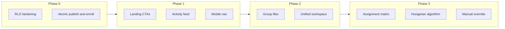

# Trippy-Tropa — Product Requirements Document

**Product:** Trippy-Tropa (Smart Collaborative Group Management System)  
**Version:** 1.0  
**Last updated:** 2026-05-22  
**Status:** Living document — gaps first, then phased delivery

---

## 1. Executive summary

Trippy-Tropa is a mobile-first, responsive web application for academic group work. Officers (teachers) create classrooms, generate skill-balanced groups, assign tasks intelligently, and monitor progress. Students join via invite links, complete skill assessments, collaborate in group workspaces, and execute tasks on Kanban boards.

The codebase today delivers a **strong officer backend** (classrooms, groups, tasks, auto-assign) and **core student flows** (auth, onboarding, join, Kanban, group chat, notifications). The largest product gaps are **file sharing**, **assignment matrix visualization**, **student time estimates**, **teacher participation analytics**, **manual assignment override**, **customizable onboarding**, **Hungarian assignment algorithm**, and **production security hardening**.

This PRD leads with **missing and partial functionality**, maps them to the original nine-screen spec, and defines a **six-phase roadmap** (Phase 0–5) to close gaps.

---

## 2. Context

### 2.1 Stack and references

| Layer | Technology |
|-------|------------|
| Frontend | Next.js 16 (App Router), React 19, TypeScript |
| Styling | Tailwind CSS v4, shadcn/ui, Stitch design tokens |
| Backend | Supabase (Auth, Postgres, Realtime, Storage planned) |
| Design system | [`.interface-design/system.md`](../../.interface-design/system.md) |

### 2.2 Personas

| Persona | Goals |
|---------|--------|
| **Officer / Teacher** | Create classes, invite students, balance groups, assign tasks, monitor participation, override when needed |
| **Student** | Join class, self-assess skills, collaborate in group, complete tasks, see assignments |

### 2.3 Route map

Defined in [`src/lib/constants/routes.ts`](../../src/lib/constants/routes.ts):

| Area | Routes |
|------|--------|
| Public | `/`, `/login`, `/register`, `/join`, `/join/c/[code]` |
| Onboarding | `/onboarding/skills` |
| Officer | `/officer/dashboard`, `/officer/classrooms/new`, `/officer/classrooms/[id]`, groups, tasks |
| Student | `/student/dashboard`, `/student/classrooms/[id]/group`, `tasks`, `assignments` |

### 2.4 Design direction

- **Feel:** Clean modern SaaS — Notion × ClickUp × Discord (structure + collaboration)
- **Palette:** Blue (`#004ac6`), white, subtle gray (`#faf8ff` canvas, `#c3c6d7` borders)
- **Typography:** Plus Jakarta Sans (`font-heading` for titles)
- **Layout:** Dashboard cards, Kanban columns, soft rounded corners, subtle shadows
- **Responsive:** Mobile bottom tabs (student/officer shells), desktop sidebars

---

## 3. Missing and partial functionality (priority inventory)

Gaps are ordered **P0** (production / integrity) → **P1** (core PRD screens) → **P2** (differentiation) → **P3** (polish).

Legend: **Status** = `missing` | `partial` | `stub`

---

### 3.1 P0 — Production safety and data integrity

| ID | Area | Status | Evidence | Required behavior | Acceptance criteria |
|----|------|--------|----------|-------------------|---------------------|
| GAP-S-001 | Profile privilege escalation | partial | [`supabase/migrations/003_rbac_auth.sql`](../../supabase/migrations/003_rbac_auth.sql) — `profiles_update_own` | Students cannot set `role = officer` or `skills_completed = true` via client | Manual test: `UPDATE profiles SET role = 'officer'` fails for authenticated student |
| GAP-S-002 | Classroom invite enumeration | partial | `classrooms_select` policy `using (true)` | Invite lookup scoped; no bulk read of all `invite_code` | Anon/authenticated client cannot list all classrooms |
| GAP-S-003 | Dev-only admin signup | partial | [`src/app/actions/auth.ts`](../../src/app/actions/auth.ts), [`src/lib/supabase/admin.ts`](../../src/lib/supabase/admin.ts) | `SUPABASE_SERVICE_ROLE_KEY` signup only when `NODE_ENV=development` or explicit flag | Production deploy without service role still registers via standard Auth |
| GAP-S-004 | Non-atomic group publish | partial | [`src/app/actions/groups.ts`](../../src/app/actions/groups.ts) `publishGroups` | Delete + insert in transaction or safe swap | Mid-failure leaves prior groups or clear rollback |
| GAP-S-005 | Enroll after skills race | partial | [`src/app/actions/join-classroom.ts`](../../src/app/actions/join-classroom.ts) `completeSkillAssessment` | Set `skills_completed` only after successful enroll when invite present | Failed enroll does not block re-onboarding |
| GAP-S-006 | Weak task delete authorization | partial | [`src/app/actions/tasks.ts`](../../src/app/actions/tasks.ts) `deleteTask` | Verify task belongs to `classroomId` before delete | Wrong ID returns error, zero rows deleted |
| GAP-S-007 | Predictable invite codes | partial | [`src/lib/invite.ts`](../../src/lib/invite.ts) | CSPRNG + longer codes | Codes not guessable via `Math.random` |
| GAP-S-008 | Performance: auto-assign N+1 | partial | [`src/app/actions/tasks.ts`](../../src/app/actions/tasks.ts) | Batch queries + bulk updates | Single classroom assign &lt; 2s for 50 tasks / 30 students |
| GAP-S-009 | Performance: DB indexes | missing | Migrations 001–009 | Indexes on `tasks(group_id)`, `group_members(user_id)`, `classroom_members`, etc. | Migration `010_indexes.sql` applied |

**Dependencies:** Phase 0 blocks production launch.

---

### 3.2 P1 — Core user journeys and PRD screens

| ID | PRD screen | Feature | Status | Evidence | Required behavior | Acceptance criteria |
|----|------------|---------|--------|----------|-------------------|---------------------|
| GAP-F-001 | 1 Landing | Hero + dual CTA above fold | full | [`src/app/page.tsx`](../../src/app/page.tsx) | Primary: **Join classroom** → `/join`; Secondary: **Create classroom** → `/officer/classrooms/new` | Both CTAs visible without scrolling on mobile |
| GAP-F-002 | 1 Landing | Features section (3–4 pillars) | full | [`src/app/page.tsx`](../../src/app/page.tsx) | Dedicated features grid: group formation, task assignment, collaboration, progress | Icons + copy match PRD positioning |
| GAP-F-003 | 2 Auth | Password reset | stub | [`auth-card.tsx`](../../src/components/auth/auth-card.tsx) | Supabase reset email flow | User receives reset link and can set new password |
| GAP-F-004 | 2 Auth | SSO placeholder | stub | Auth card “University Portal” toast | Implement OIDC or remove until ready | No dead-end button in production |
| GAP-F-005 | 2 Auth | Preserve invite `code` in middleware | partial | [`src/lib/supabase/middleware.ts`](../../src/lib/supabase/middleware.ts) | Redirects from `/login` keep `?code=` and `redirect` | Register from invite resumes join after auth |
| GAP-F-006 | 4 Dashboard | Classroom activity feed | missing | [`officer-dashboard-view.tsx`](../../src/components/officer/officer-dashboard-view.tsx) | Chronological events: enroll, group publish, task changes, assign runs | Officer sees last 20 events per classroom or global |
| GAP-F-007 | 4 Dashboard | Create classroom modal | missing | Full page [`/officer/classrooms/new`](../../src/app/officer/classrooms/new/page.tsx) | Sheet/Dialog on dashboard with same fields as create page | Create without leaving dashboard |
| GAP-F-008 | 4 Dashboard | Student join from dashboard | partial | [`student-dashboard-view.tsx`](../../src/components/student/student-dashboard-view.tsx) | Invite code field → enroll | Student joins new class from dashboard |
| GAP-F-009 | 4 Dashboard | Student profile avatar | partial | [`student-dashboard-demo.ts`](../../src/lib/constants/student-dashboard-demo.ts) `STUDENT_PROFILE` | Use initials or uploaded avatar from profile | No hardcoded external avatar URL |
| GAP-F-010 | 4 Dashboard | Student search / schedule | stub | Disabled search; “coming soon” toasts | Search enrolled classes/tasks or defer with hidden UI | No misleading enabled controls |
| GAP-F-011 | 5 Classroom detail | Interactive analytics charts | partial | [`classroom-detail-view.tsx`](../../src/components/officer/classroom-detail-view.tsx) — CSS bars | Recharts line/bar for skill distribution, enrollment trend | At least 2 chart types on detail page |
| GAP-F-012 | 6 Workspace | Unified tabbed workspace | partial | Group hub + separate [`tasks/page`](../../src/app/student/classrooms/[id]/tasks/page.tsx) | Single route: **Board \| Members \| Chat \| Files** | No extra navigation to reach Kanban |
| GAP-F-013 | 6 Workspace | File upload / shared files | missing | No Storage in `src/` | Upload, list, download per group; Supabase Storage + RLS | Member uploads PDF; peers can download |
| GAP-F-014 | 7 Assignment | Student time estimate matrix | missing | Officer sets `estimated_hours` on task only | Table: rows = students, cols = tasks; each cell = hours estimate | All group members submit before “Generate” enabled |
| GAP-F-015 | 7 Assignment | Matrix / heatmap visualization | missing | [`officer-tasks-view.tsx`](../../src/components/officer/officer-tasks-view.tsx) table only | Grid colored by assignee + match score | Officer sees student × task grid after optimize |
| GAP-F-016 | 7 Assignment | Manual assignment override | missing | — | Reassign task to another student; optional reason; audit log | Override persists; student notification sent |
| GAP-F-017 | 7 Assignment | Idempotent auto-assign | partial | [`task-assigner.ts`](../../src/lib/algorithms/task-assigner.ts) | Default: only unassigned tasks; `forceReassign` flag for officer | Re-run does not reshuffle unless forced |
| GAP-F-018 | 8 Teacher | Participation metrics | missing | Dashboard stat cards only | Per-student: last active, tasks moved, messages sent, assessment status | Officer identifies at-risk students |
| GAP-F-019 | 8 Teacher | Override assignments (classroom view) | missing | — | Bulk view of assignments with inline reassign | Same as GAP-F-016 at classroom scope |
| GAP-F-020 | 3 Onboarding | Officer-customizable skills | missing | Fixed 4 skills [`skills.ts`](../../src/lib/constants/skills.ts) | Officer defines metrics per classroom (label, description, 1–5 scale) | Dynamic onboarding form per class |
| GAP-F-021 | 9 Mobile | Tasks tab routing | partial | [`student-shell.tsx`](../../src/components/layout/student-shell.tsx) `match: () => false` | Tasks tab → aggregate task list or last classroom board | Tab highlights correctly |
| GAP-F-022 | 9 Mobile | Notifications tab routing | partial | Hash `#updates` on dashboard only | Dedicated `/student/notifications` or scroll to feed | Tab opens notification list |
| GAP-F-023 | 9 Mobile | Responsive Kanban | partial | [`kanban-board.tsx`](../../src/components/tasks/kanban-board.tsx) | Horizontal scroll columns on `sm`; touch DnD | Usable on 375px width |

**Dependencies:** P1 items depend on Phase 0 for RLS; file upload depends on Storage bucket setup.

---

### 3.3 P2 — Algorithms and documentation (from product notes)

| ID | Feature | Status | Evidence | Required behavior | Acceptance criteria |
|----|---------|--------|----------|-------------------|---------------------|
| GAP-A-001 | Greedy assignment documentation | missing | [`task-assigner.ts`](../../src/lib/algorithms/task-assigner.ts) | `docs/algorithms/greedy-assignment.md` with complexity, inputs, limitations | Linked from officer tasks UI |
| GAP-A-002 | Hungarian algorithm implementation | missing | [`.cursor/notes.txt`](../../.cursor/notes.txt) | Optimal bipartite matching student×task by cost matrix | Officer selects “Hungarian” strategy; completes in reasonable time |
| GAP-A-003 | Hungarian documentation | missing | — | `docs/algorithms/hungarian-assignment.md` | Explains when to use vs greedy |
| GAP-A-004 | Group balancing strategies | partial | [`group-generation-view.tsx`](../../src/components/officer/group-generation-view.tsx) toast | Implement or hide non-skill strategies | UI matches available algorithms only |

**Dependencies:** Phase 3. Requires student time estimates (GAP-F-014) for meaningful cost matrix.

---

### 3.4 P3 — Polish and performance

| ID | Feature | Status | Evidence | Required behavior |
|----|---------|--------|----------|-------------------|
| GAP-P-001 | Duplicate notification subscriptions | partial | Dashboard + bell both subscribe | Single realtime hook per user session |
| GAP-P-002 | Realtime full page refresh | partial | [`use-tasks-realtime.ts`](../../src/hooks/use-tasks-realtime.ts) | Patch local Kanban state on events |
| GAP-P-003 | Terms / Privacy pages | stub | Toast in auth card | Static pages or external links |
| GAP-P-004 | Officer mobile nav dead links | partial | [`officer-shell.tsx`](../../src/components/layout/officer-shell.tsx) | Wire Tasks/Notifications tabs |
| GAP-P-005 | Invite code case sensitivity | partial | Join lookups | Normalize to lowercase on write/read |

---

### 3.5 Gap summary by PRD screen

| Screen | Missing | Partial | Full |
|--------|---------|---------|------|
| 1 Landing | — | Screen 1 complete (GAP-F-001, F-002) | Page exists |
| 2 Auth | Password reset, SSO | Invite banner, register server action | Login, register, invite join |
| 3 Onboarding | Custom metrics per class | — | 3-step 1–5 assessment |
| 4 Dashboard | Activity feed, create modal | Student avatar, search stub | Officer cards; student live data |
| 5 Classroom detail | Charts | Skill bars, roster | Roster, invite, group links |
| 6 Workspace | Files, unified tabs | Kanban separate route | Members, chat, progress |
| 7 Assignment | Estimates matrix, heatmap, override | Greedy assign, results table | Task CRUD, auto-assign |
| 8 Teacher dashboard | Participation, override UI | Aggregate stats | Classroom grid |
| 9 Mobile | Tab routing | Kanban responsive | Bottom nav shells |



---

## 4. Original PRD — nine screens (target vs current)

### Screen 1 — Landing page

**Vision:** Hero explaining intelligent group formation and task assignment; features section; CTAs **Create Classroom** and **Join Classroom**.

| Component | Target | Current | Route / component |
|-----------|--------|---------|-------------------|
| Hero | Value prop + dual CTA | Full | [`src/app/page.tsx`](../../src/app/page.tsx) — Join + Create above fold |
| Features | 3–4 feature blocks | Full — 4 pillar grid | Same |
| CTA Create | Officer path | Full | `routes.officer.createClassroom` |
| CTA Join | Student join | Full | `routes.join` |

**Gaps:** — (Screen 1 complete)

---

### Screen 2 — Authentication

**Vision:** Login, register, accept invite (preview class → auth → resume).

| Component | Target | Current | Route / component |
|-----------|--------|---------|-------------------|
| Login | Email + password | Full | [`auth-card.tsx`](../../src/components/auth/auth-card.tsx), `/login` |
| Register | Full name, email, password | Full (server `signUpStudent`) | `/register` |
| Accept invite | Context banner + code | Full | `?code=` on auth; [`/join/c/[code]`](../../src/app/join/c/[code]/page.tsx) |
| Password reset | Email link | Stub | GAP-F-003 |
| SSO | University portal | Stub | GAP-F-004 |

**Gaps:** GAP-F-003, GAP-F-004, GAP-F-005

---

### Screen 3 — Onboarding skill assessment

**Vision:** Multi-step form; rate skills 1–5; technical and soft skills; progress indicator.

| Component | Target | Current | Route / component |
|-----------|--------|---------|-------------------|
| Multi-step wizard | 3 steps | Full | [`skill-assessment-view.tsx`](../../src/components/onboarding/skill-assessment-view.tsx) |
| 1–5 ratings | 4 fixed skills | Full | `SKILL_DEFINITIONS` |
| Progress indicator | Step 1/3 | Full | Wizard UI |
| Officer-custom metrics | Per classroom | Missing | GAP-F-020 |

**Gaps:** GAP-F-020 (Phase 4)

---

### Screen 4 — Classroom dashboard

**Vision:** Classroom cards; join via code; create classroom modal; recent activity feed.

| Component | Target | Current | Route / component |
|-----------|--------|---------|-------------------|
| Officer classroom cards | List + stats | Full | [`officer-dashboard-view.tsx`](../../src/components/officer/officer-dashboard-view.tsx) |
| Student classroom cards | Enrolled list | Full (live data) | [`student-dashboard.ts`](../../src/app/actions/student-dashboard.ts) |
| Join via code | Input + submit | Partial | `routes.join`; GAP-F-008 on student dash |
| Create modal | On dashboard | Missing — full page | [`create-classroom-view.tsx`](../../src/components/classrooms/create-classroom-view.tsx) |
| Activity feed | Recent events | Missing | GAP-F-006 |

**Gaps:** GAP-F-006, GAP-F-007, GAP-F-008, GAP-F-009, GAP-F-010

---

### Screen 5 — Classroom detail

**Vision:** Member list; group generation; auto-group; analytics cards; invite sharing.

| Component | Target | Current | Route / component |
|-----------|--------|---------|-------------------|
| Member list | Searchable roster | Full | [`classroom-detail-view.tsx`](../../src/components/officer/classroom-detail-view.tsx) |
| Group generation | Link + controls | Full | `routes.officer.generateGroups` |
| Auto-group | Balancer + publish | Full | [`group-generation-view.tsx`](../../src/components/officer/group-generation-view.tsx) |
| Analytics cards | Charts + KPIs | Partial — stat tiles, skill bars | GAP-F-011 |
| Invite sharing | Link + QR | Full | [`classroom-invite-qr.tsx`](../../src/components/classrooms/classroom-invite-qr.tsx) |

**Gaps:** GAP-F-011

---

### Screen 6 — Group workspace

**Vision:** Kanban; Todo / In Progress / Review / Done; members sidebar; chat; file upload; progress card.

| Component | Target | Current | Route / component |
|-----------|--------|---------|-------------------|
| Kanban | 4 columns, DnD | Full (separate route) | [`kanban-board.tsx`](../../src/components/tasks/kanban-board.tsx), `/tasks` |
| Members sidebar | Leader highlight | Full | [`student-group-workspace-view.tsx`](../../src/components/student/student-group-workspace-view.tsx) |
| Chat | Realtime messages | Full | [`group-chat-panel.tsx`](../../src/components/chat/group-chat-panel.tsx), migration 008 |
| File upload | Shared files | Missing | GAP-F-013 |
| Progress card | % complete | Full | Group workspace progress bar |
| Unified layout | Single screen tabs | Partial | GAP-F-012 |

**Gaps:** GAP-F-012, GAP-F-013

---

### Screen 7 — Intelligent task assignment

**Vision:** Student time estimate table; “Generate Optimal Assignment”; matrix visualization.

| Component | Target | Current | Route / component |
|-----------|--------|---------|-------------------|
| Task table (officer) | CRUD | Full | [`officer-tasks-view.tsx`](../../src/components/officer/officer-tasks-view.tsx) |
| Time estimates (students) | Matrix input | Missing | GAP-F-014 |
| Generate button | Run optimizer | Full (greedy) | `autoAssignTasks` |
| Results visualization | Matrix layout | Partial — table | GAP-F-015 |
| Student view | Read assignments | Full | [`student-assignments-view.tsx`](../../src/components/student/student-assignments-view.tsx) |
| Override | Manual reassign | Missing | GAP-F-016 |

**Gaps:** GAP-F-014–017, GAP-A-001–004

---

### Screen 8 — Teacher / admin dashboard

**Vision:** Classroom monitoring; group analytics; participation metrics; student activity; override assignments.

| Component | Target | Current | Route / component |
|-----------|--------|---------|-------------------|
| Classroom monitoring | Grid + detail drill-down | Partial | Officer dashboard + detail |
| Group analytics | Per-group progress | Partial | [`group-management-view.tsx`](../../src/components/officer/group-management-view.tsx) |
| Participation metrics | Engagement over time | Missing | GAP-F-018 |
| Student activity | Activity feed | Missing | GAP-F-006 |
| Override assignments | Reassign UI | Missing | GAP-F-019 |

**Gaps:** GAP-F-006, GAP-F-018, GAP-F-019

---

### Screen 9 — Mobile responsive views

**Vision:** Mobile navigation; bottom tabs; responsive Kanban; mobile-friendly cards.

| Component | Target | Current | Route / component |
|-----------|--------|---------|-------------------|
| Bottom tabs | Student + officer | Partial | [`student-shell.tsx`](../../src/components/layout/student-shell.tsx), [`officer-shell.tsx`](../../src/components/layout/officer-shell.tsx) |
| Responsive cards | Stack on mobile | Full | Stitch responsive grids |
| Responsive Kanban | Horizontal scroll | Partial | GAP-F-023 |

**Gaps:** GAP-F-021, GAP-F-022, GAP-F-023

---

## 5. Phased delivery roadmap

### Phase 0 — Production safety and data integrity

**Goal:** Safe to deploy; no privilege escalation or data loss during core flows.

**In scope**

- Migration: profile column protection (trigger or restricted `UPDATE` policy)
- Invite-scoped classroom read (RPC `get_classroom_by_invite` or tightened RLS)
- Dev-only `signUpStudent` admin path
- Transactional `publishGroups` (Postgres function or single RPC)
- `completeSkillAssessment` + enroll ordering fix
- `deleteTask` authorization + row count check
- CSPRNG invite codes
- Migration `010_performance_indexes.sql`
- Batch `autoAssignTasks` refactor

**Out of scope**

- New user-facing features

**User stories**

- As a student, I cannot promote myself to officer.
- As an officer, publishing groups never leaves my classroom empty on error.

**Key files**

- `supabase/migrations/010_*.sql`, `011_rls_hardening.sql`
- `src/app/actions/groups.ts`, `join-classroom.ts`, `tasks.ts`, `auth.ts`
- `src/lib/invite.ts`

**Acceptance criteria**

- Security review P0 gaps closed
- `npm run build` passes
- Manual regression: register → onboard → join → publish groups

**Estimated effort:** 1–2 weeks

---

### Phase 1 — Core journey completion

**Goal:** Complete PRD screens 1, 2, 4, 9 for the primary student and officer happy paths.

**In scope**

- Landing: complete (GAP-F-001, F-002)
- Middleware: preserve `code` / `redirect` on auth redirects (GAP-F-005)
- Student dashboard: join code input, real avatar/initials (GAP-F-008, F-009)
- Remove or hide search/schedule stubs (GAP-F-010)
- Mobile: wire Tasks and Notifications tabs (GAP-F-021, F-022)
- Officer activity feed v1 — table `classroom_activity_events` (GAP-F-006)

**Out of scope**

- File upload, Hungarian algorithm, custom onboarding

**User stories**

- As a visitor, I can join or create a classroom from the home page.
- As a student on mobile, bottom tabs take me to real destinations.
- As an officer, I see who joined and when groups were published.

**Schema touchpoints**

```sql
-- classroom_activity_events (proposed)
id uuid PK
classroom_id uuid FK
actor_id uuid FK nullable
event_type text -- enrolled | groups_published | task_created | assignment_run
payload jsonb
created_at timestamptz
```

**Key files**

- `src/app/page.tsx`
- `src/components/student/student-dashboard-view.tsx`
- `src/components/layout/student-shell.tsx`
- `src/components/officer/officer-dashboard-view.tsx`
- `src/lib/supabase/middleware.ts`

**Acceptance criteria**

- New student: landing → register → onboarding → join → dashboard (mobile)
- Officer sees activity feed with last 20 events

**Depends on:** Phase 0

**Estimated effort:** 2–3 weeks

---

### Phase 2 — Unified group workspace and files

**Goal:** PRD Screen 6 complete — one workspace, files included.

**In scope**

- Workspace layout: tabs `Board | Members | Chat | Files` (GAP-F-012)
- Supabase Storage bucket `group-files` + table `group_files` (GAP-F-013)
- Upload, list, download UI; RLS by `group_members`
- Embed or route Kanban inside Board tab

**Out of scope**

- Versioning, comments on files, virus scan

**User stories**

- As a student, I manage tasks, chat, and files without leaving my group workspace.
- As a group member, I download a file uploaded by a peer.

**Schema touchpoints**

```sql
group_files (
  id uuid PK,
  group_id uuid FK,
  uploaded_by uuid FK,
  storage_path text,
  file_name text,
  mime_type text,
  size_bytes bigint,
  created_at timestamptz
)
```

**Key files**

- `src/app/student/classrooms/[id]/group/page.tsx`
- `src/components/student/student-group-workspace-view.tsx`
- `src/components/student/student-kanban-view.tsx` (merge into tabs)
- `src/app/actions/files.ts` (new)

**Acceptance criteria**

- Upload ≤ 10MB file; visible to all group members within 5s
- Kanban accessible from Board tab on mobile

**Depends on:** Phase 1

**Estimated effort:** 3–4 weeks

---

### Phase 3 — Intelligent assignment

**Goal:** PRD Screen 7 + algorithm notes — estimates, matrix, Hungarian, override, docs.

**In scope**

- `task_time_estimates` (student_id, task_id, hours) + student UI (GAP-F-014)
- Officer matrix / heatmap after assign (GAP-F-015)
- Greedy docs: `docs/algorithms/greedy-assignment.md` (GAP-A-001)
- Hungarian implementation + toggle in officer tasks (GAP-A-002, A-003)
- Manual override + `assignment_audit` log (GAP-F-016, F-019)
- Auto-assign: unassigned-only default (GAP-F-017)

**Out of scope**

- ML-based assignment; external solver services

**User stories**

- As a student, I enter how long each task will take me.
- As an officer, I choose Greedy or Hungarian and see a color matrix of assignments.
- As an officer, I drag a task to another student and leave a reason.

**Schema touchpoints**

```sql
task_time_estimates (
  student_id uuid,
  task_id uuid,
  estimated_hours numeric,
  updated_at timestamptz,
  PRIMARY KEY (student_id, task_id)
)

assignment_audit (
  id uuid PK,
  task_id uuid FK,
  from_student_id uuid,
  to_student_id uuid,
  changed_by uuid FK,
  reason text,
  created_at timestamptz
)
```

**Key files**

- `src/lib/algorithms/hungarian-assigner.ts` (new)
- `src/lib/algorithms/task-assigner.ts`
- `src/app/actions/tasks.ts`
- `src/components/officer/officer-tasks-view.tsx`
- `src/components/officer/assignment-matrix.tsx` (new)
- `docs/algorithms/*.md`

**Acceptance criteria**

- All students submit estimates → officer runs Hungarian → matrix displays → override one cell → student dashboard updates
- Documentation linked from UI “How it works”

**Depends on:** Phase 0 (performance), Phase 2 optional

**Estimated effort:** 3–4 weeks

---

### Phase 4 — Teacher analytics and configurable onboarding

**Goal:** PRD Screens 3 (extended), 5, 8 — analytics and customization.

**In scope**

- Participation dashboard: charts (Recharts), per-student table (GAP-F-018)
- `classroom_skill_templates` + dynamic onboarding form (GAP-F-020)
- Create classroom Sheet on officer dashboard (GAP-F-007)
- Classroom detail charts (GAP-F-011)

**Out of scope**

- Export to CSV/PDF; parent portal

**User stories**

- As an officer, I add a “Presentation” skill metric for my communications class.
- As an officer, I see which students have not moved a task in 7 days.

**Schema touchpoints**

```sql
classroom_skill_templates (
  id uuid PK,
  classroom_id uuid FK,
  key text,
  label text,
  description text,
  sort_order int
)

-- skill_ratings may need JSONB or EAV for dynamic keys
```

**Key files**

- `src/components/officer/participation-dashboard.tsx` (new)
- `src/components/onboarding/skill-assessment-view.tsx`
- `src/app/actions/onboarding.ts` (new)

**Acceptance criteria**

- Officer adds 5th skill metric; new students see it in onboarding
- Participation page shows 7-day task activity chart

**Depends on:** Phase 1 (activity events), Phase 3 (assignment data)

**Estimated effort:** 2–3 weeks

---

### Phase 5 — Mobile, auth polish, production

**Goal:** Production-ready UX and performance.

**In scope**

- Responsive Kanban horizontal scroll + touch DnD (GAP-F-023)
- Optimistic Kanban / notification updates (GAP-P-002)
- Password reset (GAP-F-003)
- Dedupe notification subscriptions (GAP-P-001)
- Middleware profile cache / JWT claims (performance)
- Terms & Privacy pages (GAP-P-003)
- Remove or implement SSO (GAP-F-004)
- Officer mobile nav fixes (GAP-P-004)

**Out of scope**

- Native iOS/Android apps

**Acceptance criteria**

- Lighthouse mobile performance ≥ 80 performance score on student dashboard
- No `SUPABASE_SERVICE_ROLE_KEY` in production env
- Password reset works end-to-end

**Depends on:** Phases 0–4

**Estimated effort:** 1–2 weeks

---

### Phase timeline overview

| Phase | Focus | Duration (est.) |
|-------|--------|-----------------|
| 0 | Safety & integrity | 1–2 wk |
| 1 | Core journeys, landing, mobile nav, activity | 2–3 wk |
| 2 | Workspace + files | 3–4 wk |
| 3 | Assignment matrix, Hungarian, override | 3–4 wk |
| 4 | Analytics, custom onboarding | 2–3 wk |
| 5 | Mobile polish, auth, perf | 1–2 wk |

**Total estimated:** 12–18 weeks (single full-stack team, sequential)

---

## 6. What is already implemented (baseline)

Use this appendix to avoid re-building shipped features.

| Capability | Status | Primary paths |
|------------|--------|----------------|
| Auth login / register | Full | `src/components/auth/auth-card.tsx`, `src/app/actions/auth.ts` |
| Invite join flow | Full | `src/lib/auth/join-flow.ts`, `src/app/join/c/[code]/page.tsx` |
| RBAC middleware | Full | `src/lib/supabase/middleware.ts`, `src/lib/auth/rbac.ts` |
| Skill onboarding (fixed 4 skills) | Full | `src/components/onboarding/skill-assessment-view.tsx` |
| Officer create classroom + invite/QR | Full | `src/components/classrooms/create-classroom-view.tsx` |
| Officer classroom detail + roster | Full | `src/components/officer/classroom-detail-view.tsx` |
| Group generation (greedy balance) + DnD + publish | Full | `src/components/officer/group-generation-view.tsx` |
| Group management view | Full | `src/components/officer/group-management-view.tsx` |
| Officer task CRUD | Full | `src/components/officer/officer-tasks-view.tsx` |
| Greedy auto-assign | Full | `src/lib/algorithms/task-assigner.ts`, `autoAssignTasks` |
| Student dashboard (live data) | Full | `src/app/actions/student-dashboard.ts` |
| Student group workspace (members, progress, chat) | Full | `src/components/student/student-group-workspace-view.tsx` |
| Group chat realtime | Full | `src/components/chat/group-chat-panel.tsx`, `008_group_messages.sql` |
| Student Kanban + DnD + status updates | Full | `src/components/tasks/kanban-board.tsx` |
| Tasks realtime | Full | `src/hooks/use-tasks-realtime.ts` |
| Notifications + realtime bell | Full | `src/components/notifications/*`, `007_notifications_realtime.sql` |
| Student assignment results view | Full | `src/components/student/student-assignments-view.tsx` |
| Structured logging | Full | `src/lib/logger.ts` |
| Dev seed users | Full | `supabase/migrations/004_seed_dev_users.sql`, `SEED_USERS.md` |

**Database migrations shipped:** `001`–`009` (schema, RLS, seeds, tasks skills, notifications, group messages, demo data).

---

## 7. Non-functional requirements

### 7.1 Accessibility

- WCAG 2.1 AA target for primary flows (auth, join, Kanban, forms)
- Keyboard navigable Kanban moves (DnD kit already used)
- `aria-label` on icon-only buttons; progress bars with `aria-valuenow`

### 7.2 Performance

| Metric | Target |
|--------|--------|
| LCP (dashboard) | &lt; 2.5s on 4G |
| Auto-assign (30 students, 20 tasks) | &lt; 3s server-side |
| Realtime task update latency | &lt; 2s perceived |

### 7.3 Realtime

- Supabase Realtime for `tasks`, `notifications`, `group_messages`
- RLS enforced on all replicated tables
- Graceful degradation if Realtime disconnected (polling fallback optional)

### 7.4 Security

- No service role key in client bundle
- All mutations via server actions or RLS-protected client
- Email rate limits documented; dev bypass documented in `SEED_USERS.md`

---

## 8. Proposed data model additions (summary)

| Table | Phase | Purpose |
|-------|-------|---------|
| `classroom_activity_events` | 1 | Activity feed |
| `group_files` | 2 | File metadata + Storage path |
| `task_time_estimates` | 3 | Student hours per task |
| `assignment_audit` | 3 | Override history |
| `classroom_skill_templates` | 4 | Custom onboarding metrics |

---

## 9. Success metrics

| Phase | Metric |
|-------|--------|
| 0 | Zero critical security findings in retest |
| 1 | 90% of test students complete join flow on first attempt |
| 2 | ≥ 1 file uploaded per group in pilot |
| 3 | Officer completes assign + override in &lt; 5 minutes |
| 4 | Officers create ≥ 1 custom skill metric in pilot |
| 5 | Mobile Lighthouse performance ≥ 80 |

---

## 10. Out of scope

- Native iOS / Android applications
- Video calls / live lecture streaming
- LTI / Canvas deep integration (future phase)
- Paid billing / subscriptions
- Multi-tenant university-wide admin (super-admin)
- AI chat tutor / automatic grading of submissions
- Offline-first PWA

---

## 11. Traceability matrix (gap ID → phase)

| Gap ID | Phase |
|--------|-------|
| GAP-S-001 – GAP-S-009 | 0 |
| GAP-F-001 – GAP-F-010, F-021, F-022 | 1 |
| GAP-F-012, F-013 | 2 |
| GAP-F-014 – F-017, GAP-A-001 – A-004 | 3 |
| GAP-F-007, F-011, F-018, F-019, F-020 | 4 |
| GAP-F-003, F-004, F-023, GAP-P-001 – P-005 | 5 |

---

## 12. Document maintenance

- Update **Section 3** when gaps close (change status to `full`, move to Section 6).
- Link PRs to gap IDs in commit messages: `feat(assign): close GAP-F-015 matrix heatmap`.
- Re-run gap analysis quarterly or before each major release.

---

*End of PRD*
