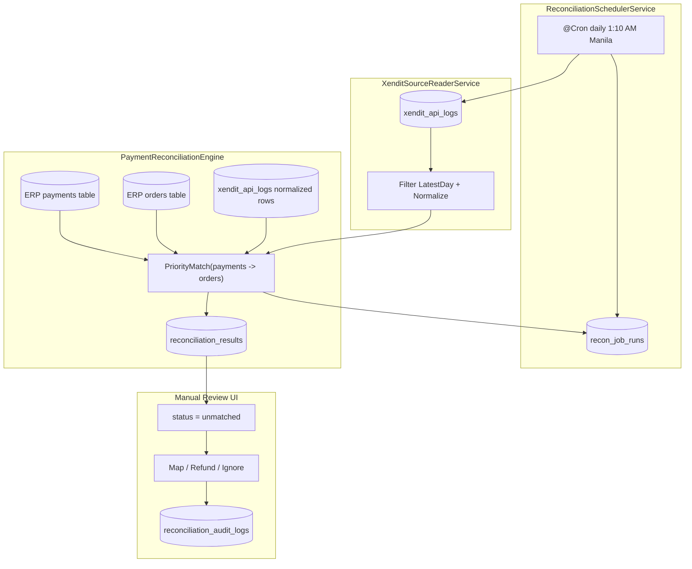

# Daily Xendit Reconciliation Plan

## Goal

Automate daily payment reconciliation where **Xendit is the source of truth**. Read latest one-day transactions from existing `xendit_api_logs`, compare against ERP (`payments` first, fallback to `orders`), and surface transactions present in Xendit but missing in ERP for manual review.

## Architecture Overview (matches diagram)



## Existing Code To Leverage

- **Reconciliation module** (extend in-place): [gorocky-erp/src/reconciliation/](gorocky-erp/src/reconciliation/) -- already registered in `app.module.ts`
- **Xendit transaction log source**: external table `xendit_api_logs` (defined in sister repo, available in same DB)
- **DatabaseService** (raw pg pool): [gorocky-erp/src/database/database.service.ts](gorocky-erp/src/database/database.service.ts) -- `query()`, `transaction()` over Supabase PostgreSQL
- **ScheduleModule** already imported in [gorocky-erp/src/app.module.ts](gorocky-erp/src/app.module.ts)
- **Existing manual CSV reconciliation** stays untouched -- the new daily job is purely additive

---

## Phase 1: Database Schema (3 tables)

All tables created via a single SQL migration file.

### 1. `recon_job_runs` -- job execution metadata

- `id` uuid PK default `gen_random_uuid()`
- `recon_date` date NOT NULL -- the business day being reconciled
- `job_type` text NOT NULL default `'daily'` -- daily / monthly / manual
- `status` text NOT NULL default `'running'` -- running, completed, failed
- `started_at` timestamptz NOT NULL default `now()`
- `completed_at` timestamptz
- `records_fetched` int default 0
- `records_matched` int default 0
- `records_unmatched` int default 0
- `error_count` int default 0
- `error_details` jsonb
- `created_at` timestamptz default `now()`
- UNIQUE(`recon_date`, `job_type`) -- prevents duplicate runs per day

### 2. `reconciliation_results` -- per-transaction match outcome

- `id` uuid PK default `gen_random_uuid()`
- `job_run_id` uuid NOT NULL FK `recon_job_runs.id`
- `xendit_log_id` int NOT NULL -- FK target `xendit_api_logs.id` (cross-repo table)
- `xendit_invoice_id` text
- `xendit_external_id` text
- `matched_erp_payment_id` text -- nullable; ERP payment_id if matched
- `matched_order_id` uuid -- nullable fallback when matched via orders
- `match_method` text -- `'payments_provider_transaction_id'`, `'payments_provider_response_plan_id'`, `'payments_provider_response_reference_id'`, `'orders_payment_id'`, `'manual'`, null
- `status` text NOT NULL default `'unmatched'` -- matched, unmatched, ignored, refund, chargeback
- `xendit_amount` numeric(12,2)
- `erp_amount` numeric(12,2)
- `amount_difference` numeric(12,2)
- `notes` text
- `resolved_by` text
- `resolved_at` timestamptz
- `created_at` timestamptz default `now()`
- `updated_at` timestamptz default `now()`
- UNIQUE(`job_run_id`, `xendit_log_id`)
- INDEX on `(status)`, `(job_run_id)`

### 3. `reconciliation_audit_logs` -- every manual action recorded

- `id` uuid PK default `gen_random_uuid()`
- `reconciliation_result_id` uuid NOT NULL FK `reconciliation_results.id`
- `action` text NOT NULL -- `'manual_map'`, `'mark_refund'`, `'mark_chargeback'`, `'ignore'`, `'reopen'`
- `previous_status` text
- `new_status` text
- `performed_by` text NOT NULL
- `notes` text
- `metadata` jsonb
- `created_at` timestamptz default `now()`
- INDEX on `(reconciliation_result_id)`

---

## Phase 2: Backend Services (inside `gorocky-erp/src/reconciliation/`)

### New file structure (additive)

```
gorocky-erp/src/reconciliation/
  reconciliation.module.ts              # UPDATE: add new providers + PaymentsModule import
  reconciliation.controller.ts          # UPDATE: add daily recon endpoints
  reconciliation.service.ts             # KEEP UNTOUCHED: existing CSV reconciliation
  types/reconciliation.types.ts         # UPDATE: add new interfaces
  daily/
    payment-gateway-ingestion.service.ts     # NEW
    payment-reconciliation-engine.service.ts  # NEW
    reconciliation-scheduler.service.ts       # NEW
```

### Service 1: `XenditSourceReaderService`

**Responsibility:** Read and normalize one-day data from existing `xendit_api_logs`.

- Query source table with Manila day window (latest day by default):
  - `paid_at` within day when available
  - fallback `created_at` within day when `paid_at` is null
- Filter to payable statuses (`is_paid = true` or `status in ('PAID','SUCCEEDED','SETTLED')`)
- Use `external_id` as main reference key from Xendit side
- Also expose: `xendit_invoice_id`, `xendit_cycle_id`, `xendit_plan_id`, `payment_type`, `raw_xendit_data`
- Returns normalized source rows + fetched count

### Service 2: `PaymentReconciliationEngine`

**Responsibility:** Compare ingested Xendit rows against ERP payments table.

1. Load normalized one-day rows from `xendit_api_logs`
2. Load ERP `payments` + `orders` for same date window
3. Run exact priority match **for each Xendit transaction**:
   - **P1:** `xendit_api_logs.external_id` = `payments.provider_transaction_id`
   - **P2:** `xendit_api_logs.external_id` = `payments.provider_response->>'plan_id'`
   - **P3:** `xendit_api_logs.external_id` = `payments.provider_response->>'reference_id'`
   - **P4:** `xendit_api_logs.external_id` = `orders.payment_id`
   - Else: unmatched
4. Upsert into `reconciliation_results`:
   - Matched: `status = 'matched'`, link IDs, record `amount_difference`
   - Unmatched: `status = 'unmatched'`, no ERP link
5. Return `{ matched, unmatched }`

### Service 3: `ReconciliationSchedulerService`

**Responsibility:** Orchestrate daily job with full lifecycle.

- `@Cron('10 1 * * *', { timeZone: 'Asia/Manila' })`
- Guard: `DISABLE_XENDIT_RECON_CRON=true`
- Lock: `isProcessing` flag
- Flow:
  1. Insert `recon_job_runs` row (`status = 'running'`)
  2. Call source reader service
  3. Call reconciliation engine
  4. Update job run with counts + `status = 'completed'`
  5. On error: `status = 'failed'`, store `error_details`

---

## Phase 3: REST API Endpoints

Add to `ReconciliationController` under `/api/reconciliation/daily/`:

- `GET  /runs` -- list job runs (paginated, filter by date range)
- `GET  /runs/:id` -- single run with summary counts
- `GET  /results?jobRunId=&status=&page=&limit=` -- paginated results
- `POST /trigger` -- manual trigger: `{ date: "2026-04-29" }`
- `PATCH /results/:id/resolve` -- manual review: `{ action, notes, performedBy }` (creates audit log)
- `GET  /results/:id/audit-log` -- audit trail for a single result

---

## Phase 4: ERP UI (`erp-ui`)

Add **"Daily Reconciliation"** tab inside the existing Xendit module.

### Components

- **DailyReconTab** -- date picker + job run history table
- **ReconJobRunsTable** -- status badges, record counts, duration
- **XenditTransactionsTable** -- displays both matched and unmatched Xendit rows
- Table columns: Xendit Invoice ID, External ID, Amount, Paid At, Payment Method/Channel, Match Status, Match Method, Matched ERP Payment ID, Matched Order ID, Actions
- Default filter: show all; quick filters for `matched` and `unmatched`
- **ReviewActionDialog** -- modal: Map / Refund / Chargeback / Ignore (with notes field)
- **AuditLogPanel** -- expandable row per result

### Service + Hooks

- `dailyReconciliationService.ts` -- API client for all endpoints
- `useDailyReconRuns()`, `useDailyReconResults()` (supports matched/unmatched/all filters), `useTriggerRecon()`, `useResolveResult()`

---

## Scalability (simple but extensible)

- **Source abstraction:** use `XenditSourceReaderService` so future switch from `xendit_api_logs` to API/CSV is isolated
- **Job type flexibility:** `recon_job_runs.job_type` supports daily / monthly / manual without new tables
- **Pluggable matching:** start with exact reference match; add fuzzy matching later without schema changes
- **Pagination everywhere:** DB reads and UI endpoints are paginated
- **Idempotent reruns:** unique constraints + upsert means re-running any date is always safe
- **Audit from day 1:** every manual resolution action logged for compliance

---

## Rollout Sequence

- **Phase 1:** SQL migration + 3 backend services + manual trigger endpoint
- **Phase 2:** Daily cron activation + review action endpoints
- **Phase 3:** ERP UI tab with unmatched table + review actions
- **Phase 4:** Hardening -- backfill utility, CSV export, alerting on high unmatched counts

## Risks and Mitigations

- **Cross-repo schema drift (`xendit_api_logs`):** define a source contract in code and validate required columns on startup
- **Timezone drift:** Manila day boundaries computed explicitly for `paid_at` / `created_at` filters
- **Duplicate runs:** UNIQUE on `(recon_date, job_type)`, upsert in results table
- **Large volumes:** batch inserts (100 per chunk), indexed queries, server-side pagination
- **Key ambiguity:** strict reference match first; unmatched go to manual review rather than guessing
